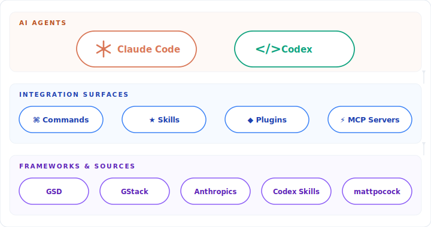
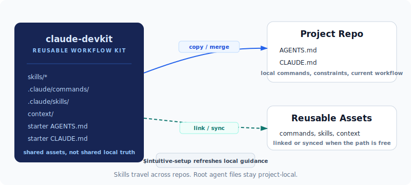

# claude-devkit

**One config. Every project. All your AI coding agents in sync.**

Claude Code + Codex + Gemini CLI — shared guidelines, skills, and workflows via symlinks. Update once, propagate everywhere.

[](LICENSE)

<p align="center">
  
</p>

---

## 30-Second Setup

```bash
# Clone once
git clone https://github.com/MiaoDX/claude-devkit.git ~/claude-devkit

# In any project directory
cd ~/your-project
~/claude-devkit/scripts/setup.sh
```

Works on macOS and Linux:

<table><tr>
<td></td>
<td></td>
</tr><tr>
<td align="center"><b>macOS</b> — setup.sh</td>
<td align="center"><b>Ubuntu</b> — update.sh</td>
</tr></table>

### Use it everywhere

Run `setup.sh` from any project directory — same command, instant symlinks:

```bash
cd ~/projects/robotics-arm   && ~/claude-devkit/scripts/setup.sh
cd ~/projects/web-dashboard   && ~/claude-devkit/scripts/setup.sh
cd ~/projects/ml-pipeline     && ~/claude-devkit/scripts/setup.sh
```

### Install all AI tools

```bash
~/claude-devkit/scripts/update.sh
```

Installs Claude Code, Gemini CLI, Codex, GSD, MCP servers, and skills — all in parallel.

---

## What's Inside

### Shared Core + Tool Entrypoints

Shared rules live in `AGENT_CORE.md`, with thin per-tool entry files:

- `CLAUDE.md` imports `AGENT_CORE.md` and keeps Claude-specific guidance small
- `AGENTS.md` keeps Codex-specific guidance self-contained and focused on delegation behavior
- `GEMINI.md` points at the shared core so Gemini projects inherit the same repo constraints

The shared core covers:

- **Parallel-first execution** — default to delegation when workstreams are independent or verification-heavy
- **Main-context protection** — keep orchestration and final synthesis in the main thread
- **Real tests, not stub theater** — UTs should predict real behavior, not just pass
- **Vis-based validation** — complement numeric tests when geometry or rendering issues are easy to miss
- **Repo constraints** — `fetch-mcp`, `uv` + `.venv`, no heavy simulations, no folder removal

### Multi-Agent Skills

Skills that teach Claude Code to orchestrate other AI tools:

| Skill | What it does |
|-------|-------------|
| **gemini** | Delegate tasks to Gemini CLI — analysis, refactoring, code review |
| **codex** / **codex-mify** | Delegate tasks to Codex CLI (with optional Azure OpenAI proxy) |
| **doc-keeper** | Audit architecture docs for drift; auto-update stale claims |

### The Ralph Loop

Iterative `review -> triage -> fix -> verify` cycle across AI agents:

| Skill | Reviews | Reviewer |
|-------|---------|----------|
| `codex-plan-ralph-refactor` | GSD phase plans | Codex |
| `codex-impl-ralph-refactor` | Implemented code | Codex |
| `agent-teams-plan-ralph-refactor` | GSD phase plans | Claude agents |
| `agent-teams-impl-ralph-refactor` | Implemented code | Claude agents |

Each variant runs parallel multi-angle review, auto-routes findings to the right files, persists state across sessions, and stops when issues converge to zero.

```bash
# Review plans before executing
/codex-plan-ralph-refactor 38

# Review code after implementation
/codex-impl-ralph-refactor 42 --fix-level must
```

### Slash Commands

| Command | What it does |
|---------|-------------|
| `/gsd_squash` | Squash noisy commits into clean, logical git history |
| `/gsd_status [N]` | Show status of last N GSD phases |
| 55+ GSD commands | Full project lifecycle — plan, execute, verify, ship |

### Scripts

| Script | Purpose |
|--------|---------|
| `setup.sh` | Symlink configs into any project |
| `update.sh` | Install/update all AI CLI tools in parallel |
| `convert-docs.sh` | Convert code/docs to LLM-ready markdown |

---

## How It Works

<p align="center">
  
</p>

Edit `AGENT_CORE.md` for shared rules, then keep each tool entry file thin.

---

## Supported Tools

| Tool | Integration |
|------|------------|
| **Claude Code** | Primary runtime — all skills and commands built for it |
| **Codex CLI** | Skills for delegation and Ralph Loop code review |
| **Gemini CLI** | Skill for task delegation with model selection |
| **GSD (Get Shit Done)** | Vendored — 55 commands, 18 specialist agents |
| **MCP Servers** | fetch-mcp installed via `update.sh` |

---

## Why This Exists

AI coding tools are powerful but chaotic — inconsistent configs, copy-pasted prompts, no shared patterns across projects.

`claude-devkit` fixes that:

1. **Consistency** — Same guidelines across all projects, always in sync
2. **Speed** — Skills and commands that encode what actually works
3. **Portability** — Symlinks, not copies — update once, propagate everywhere
4. **Multi-agent** — Claude, Codex, and Gemini working together, not in silos

Built from real usage patterns across robotics, backend, and full-stack projects. Nothing fancy, just what works.

---

## Contributing

PRs welcome — from both humans and AI agents.

Whether you're adding a new skill, improving guidelines, fixing a bug, or your AI coding agent generated a useful improvement — open a PR. Good ideas don't care who (or what) wrote them.

---

## License

MIT
