# intuitive-flow

**An opinionated operating model for agent-written software.**

`intuitive-flow` is a portable workflow kit for Claude Code and Codex. It keeps
the human surface small, puts reusable workflows in skills, and gives each repo
local `CLAUDE.md` / `AGENTS.md` guidance instead of a copied process manual.

[](LICENSE)
[](scripts/)
[](CLAUDE.md)
[](AGENTS.md)

<p align="center">
  
</p>

<p align="center">
  <a href="https://miaodx.com/LIP/share/ultrathink-to-goal/"><strong>From Ultrathink to Goal - A Year of AI Coding Engineering</strong></a><br>
  <sub><i>The interactive slide deck behind this kit · 中文</i></sub>
</p>

## Why This Exists

AI agents write all my code, so the repo needs two surfaces.

The human surface should **stay tiny**: `README.md`, `ARCHITECTURE.md`,
`STATUS.md`, `docs/human/**`, the layout, and the tests. This is where I decide
what the project is, what good means, and what must not break.

**Everything else** is agent territory: source code, plans, logs, generated
evidence, retrospectives, scratch work, and low-level churn. Humans can inspect
it when something is risky or broken. They should not have to live there.

The workflow makes **big questions expensive and small questions cheap**: use
`office-hours` or `grill-me` for what to build, `$intuitive-flow` for normal
development, and `$intuitive-refactor` to clean a system without drifting
forever. See [BELIEFS.md](BELIEFS.md) for the full doctrine.

## Start In A Repo

In the target repo, give your AI agent the skill file and ask it to initialize
local guidance:

```text
Read this skill:
https://github.com/MiaoDX/intuitive-flow/blob/main/skills/intuitive-init/SKILL.md

Then run:
Use $intuitive-init to initialize this repo's AGENTS.md and CLAUDE.md.
Run /init-style discovery if available.
Preserve project-specific instructions.
Propose a diff before applying.
```

<p align="center">
  
</p>

## Optional Tool Install (For Humans)

Clone Intuitive Flow when you want the update scripts and local skill sync:

```bash
git clone --depth=1 https://github.com/MiaoDX/intuitive-flow.git ~/intuitive-flow
~/intuitive-flow/scripts/update.sh
```

## Preferred Skills

`intuitive-flow` is both the project and the default development skill: this
repo defines the operating model, and `$intuitive-flow` runs it inside a target
repo.

| Skill | Use it for |
| --- | --- |
| **intuitive-init** | Merge `/init` suggestions, Intuitive Flow defaults, and repo evidence into local `AGENTS.md` / `CLAUDE.md` |
| **intuitive-doc** | Keep human-facing docs small, current, and separated from agent evidence/history |
| **intuitive-layout** | Improve repo/folder organization before deeper architecture work |
| **intuitive-tests** | Organize, prune, mark, and refactor tests around behavior |
| **intuitive-flow** | Move a fuzzy idea through plan review, GSD handoff, execution, cleanup, and verification |
| **intuitive-refactor** | Bound broad refactors with accepted severities, evidence, and a stop condition |
| **intuitive-squash** | Compress noisy local agent history into a clean reviewable commit story |

## Human Docs

- [README.md](README.md): orientation, install commands, and public project map
- [ARCHITECTURE.md](ARCHITECTURE.md): subsystem contracts, extension points, and proof boundaries
- [STATUS.md](STATUS.md): current state, supported commands, and next maintenance focus
- [docs/human/](docs/human/): human-facing detail that should not bloat root docs

Generated diagrams, release-note analysis, vendored tools, planning scratchpads,
and implementation evidence are context, not current truth unless a human doc
promotes them.

## Scripts

| Script | Purpose |
| --- | --- |
| `scripts/update.sh` | Install or update agent surfaces, skills, commands, GSD, and gstack |
| `scripts/dev/*.sh` | Local developer utilities for tmux and workstation sessions |
| `scripts/support/tmp-fix.sh` | Idempotent updater patch hook used by `scripts/update.sh --tmp-fix` |

For script development:

```bash
bun install
bun run verify
```

## How It Works

<p align="center">
  
</p>

Human docs define repo truth, `AGENTS.md` and `CLAUDE.md` stay project-local,
skills carry reusable workflows, and `scripts/update.sh` syncs Claude Code,
Codex, GSD, gstack, external community skill sources, and repo-owned skills
into user-level tooling. See [ARCHITECTURE.md](ARCHITECTURE.md) for subsystem
contracts and proof boundaries.

## Contributing

PRs are welcome from humans and AI agents. The most useful contributions are
sharper shared rules and fixes to workflows that drift as the underlying CLIs evolve.

Less is more.

## License

MIT - see [LICENSE](LICENSE).
